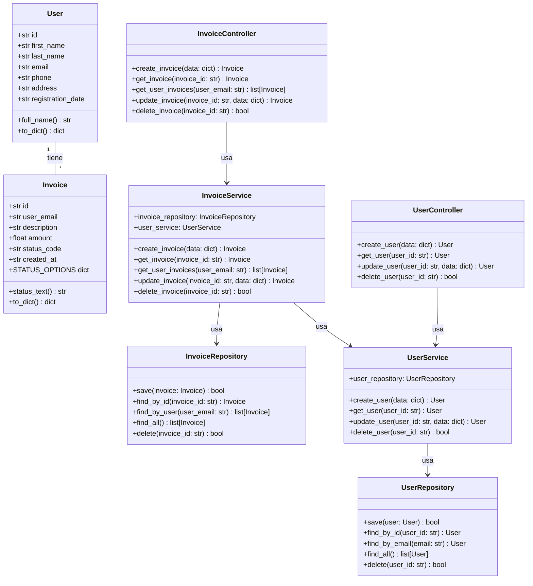
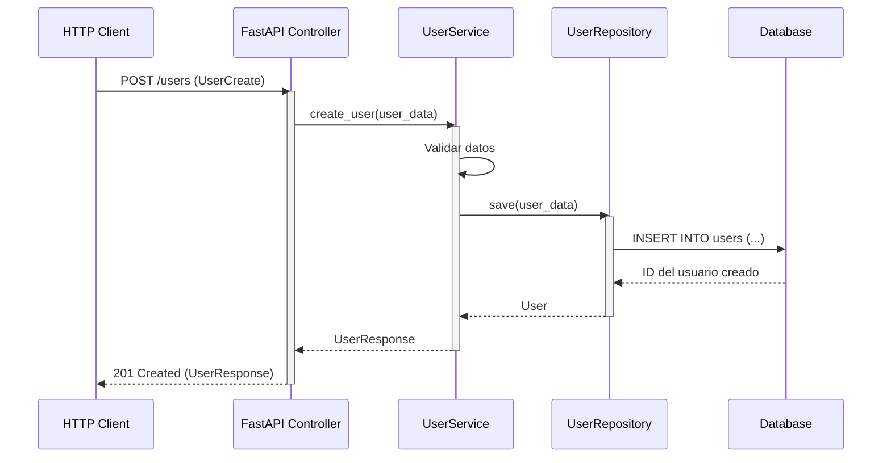
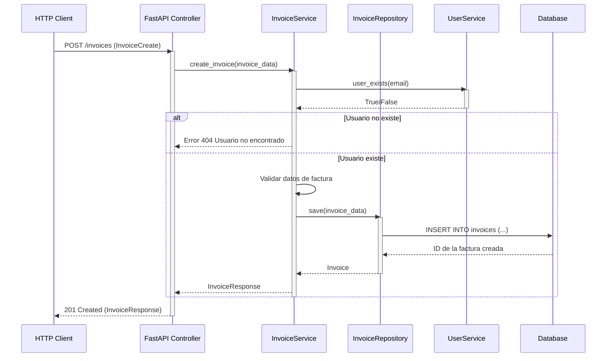
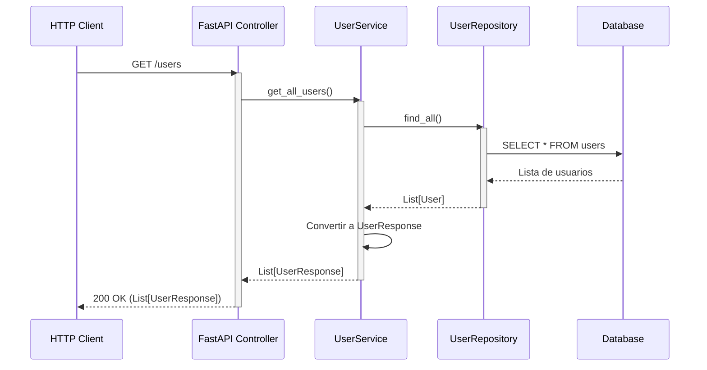

# CRM System
Customer Relationship Management system in Python with scalable architecture.

# CRM System

Customer Relationship Management (CRM) system built in Python with a scalable architecture. This project includes a backend and frontend implementation, leveraging SQLite as the database.

---

## Table of Contents

1. [Overview](#overview)
2. [Architecture](#architecture)
   - [Backend](#backend)
   - [Frontend](#frontend)
3. [Diagrams](#diagrams)
   - [Class Diagram](#class-diagram)
   - [Detailed Class Diagram](#detailed-class-diagram)
   - [Relational Database Model](#relational-database-model)
   - [Use Cases and Sequence Diagrams](#use-cases-and-sequence-diagrams)
4. [Installation](#installation)
5. [Running Locally](#running-locally)
6. [API Documentation](#api-documentation)

---

## Overview

This CRM system allows users to manage customer data and invoices efficiently. It is designed with a modular architecture to ensure scalability and maintainability. The backend handles business logic and persistence, while the frontend exposes an API for interaction.

---

## Architecture

### Backend

The backend is responsible for:
- Business logic implementation.
- Data validation using custom validators.
- Persistence management via repositories.
- Interaction with SQLite database.

Key components:
- **Controllers**: Handle user and invoice operations.
- **Services**: Implement business logic.
- **Repositories**: Manage data storage and retrieval.
- **Models**: Represent entities like `User` and `Invoice`.

### Frontend

The frontend exposes the backend functionality via a FastAPI-based REST API. It includes:
- **Routers**: Define API endpoints for users and invoices.
- **Schemas**: Validate and structure API request/response data.
- **Services**: Bridge between frontend and backend logic.

---

## Diagrams

### Class Diagram



### Detailed Class Diagram


### Relational Database Model


### Use Cases and Sequence Diagrams

#### Create User


#### Create Invoice


#### List Users



---

## Installation

1. Clone the repository:
   ```bash
   git clone https://github.com/your-repo.git
   cd your-repo