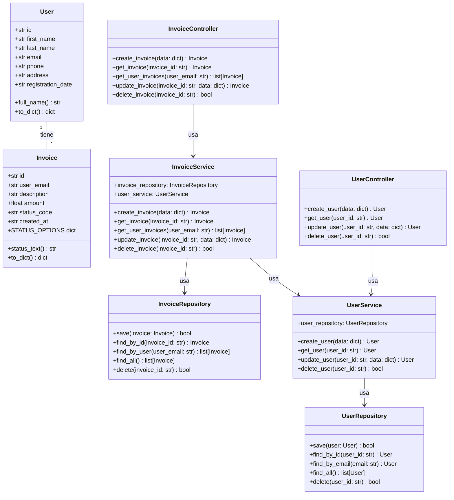
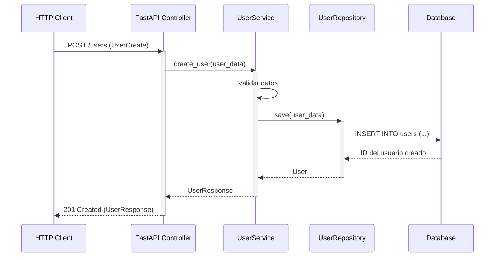
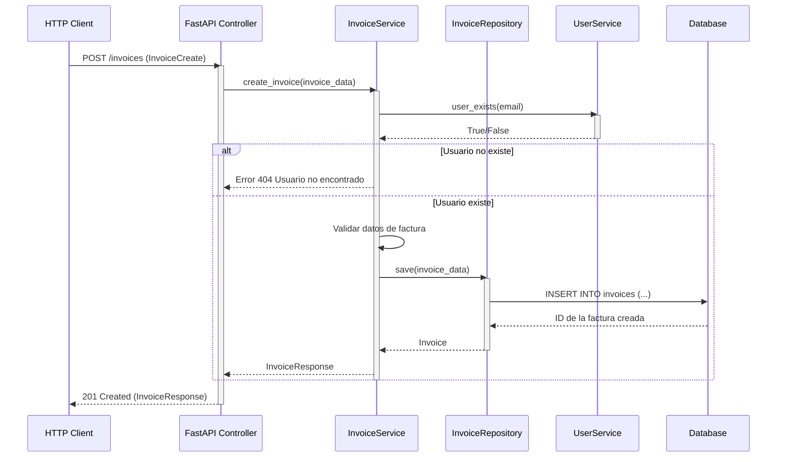
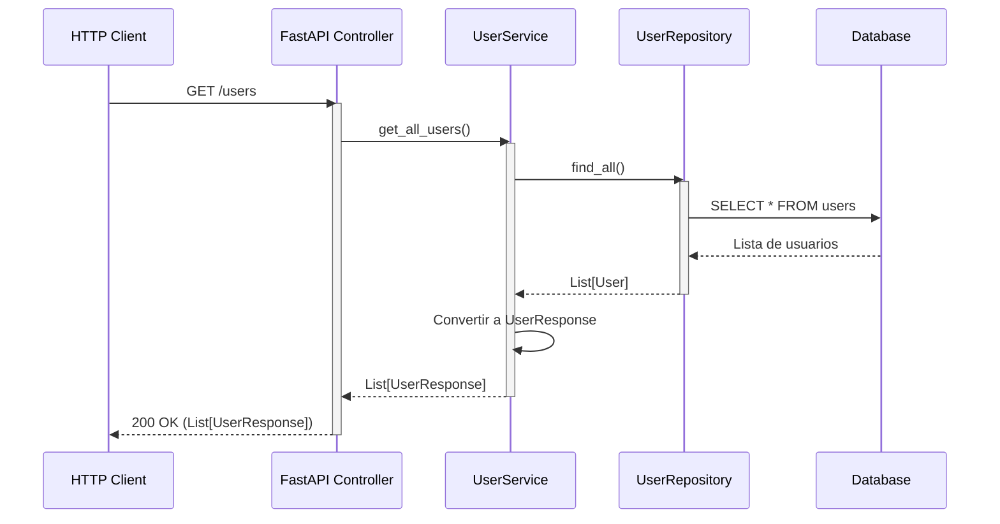

# CRM System
Customer Relationship Management system in Python with scalable architecture.

# CRM System

Customer Relationship Management (CRM) system built in Python with a scalable architecture. This project includes a backend and frontend implementation, leveraging SQLite as the database.

---

## Table of Contents

1. [Overview](#overview)
2. [Architecture](#architecture)
   - [Backend](#backend)
   - [Frontend](#frontend)
3. [Diagrams](#diagrams)
   - [Class Diagram](#class-diagram)
   - [Detailed Class Diagram](#detailed-class-diagram)
   - [Relational Database Model](#relational-database-model)
   - [Use Cases and Sequence Diagrams](#use-cases-and-sequence-diagrams)
4. [Installation](#installation)
5. [Running Locally](#running-locally)
6. [API Documentation](#api-documentation)

---

## Overview

This CRM system allows users to manage customer data and invoices efficiently. It is designed with a modular architecture to ensure scalability and maintainability. The backend handles business logic and persistence, while the frontend exposes an API for interaction.

---

## Architecture

The system follows a clean layered architecture that separates controllers, services, repositories, and schemas. This promotes maintainability, scalability, and decoupling between frontend and backend.

- Backend: Built with FastAPI and SQLite using a modular structure.
- Frontend: Implemented with Next.js (exported from v0.dev) as the graphical user interface.
- Infrastructure: Local development setup; Docker not yet configured.

### Backend
The backend is developed using FastAPI with a clean, professional layered architecture:

- routers/: Defines REST endpoints.
- schemas/: Validates input and output data.
- services/: Implements business logic.
- repositories/: Manages access to the database (SQLite).
- utils/database.py: Enables switching databases via .env.

### Frontend
The frontend interface is developed using Next.js (exported from v0.dev), and connects to the backend’s REST API. It allows user interaction with the CRM system (create users, retrieve invoices, etc.) directly from the browser.

- Runs locally at: http://localhost:8000 (configurable).
- Communicates with backend API on: http://localhost:3000.
- Decoupled from the backend, respecting the layered architecture.
---

## Diagrams

### Class Diagram



- User and Invoice: Main data models
- Controllers: Handle HTTP requests
- Services: Contain business logic
- Repositories: Manage data access
- Relationships: Shows how classes interact

### Detailed Class Diagram


Incluye:
- Domain entities
- Controller layer (FastAPI)
- Service layer
- Repository layer
- Main relationships
- Design patterns
- Validations
- ORM mapping


### Relational Database Model


Relationships:     

A user (users) can have multiple invoices
The relationship is established through the user_email field in the invoices table that references the email field in the users table

Primary Keys (PK)
users.id: Unique identifier for each user
invoices.id: Unique identifier for each invoice

Foreign Keys (FK)
invoices.user_email: References users.email (one-to-many relationship)

Indexes
users.email: For fast email lookups
invoices.user_email: To optimize invoice queries by user


### Use Cases and Sequence Diagrams

#### Create User


#### Create Invoice


#### List Users



---


## Deployment

1. Clone the repository:
   ```bash
   git clone https://github.com/your-repo.git
   cd your-repo

2. Create a virtual environment and install it (optional)

```bash
python -m venv venv
source venv/bin/activate        # En Windows: venv\Scripts\activate
```

3. Install dependencies
```bash
pip install -r requirements.txt
```

4. Create the .env file with database configuration

In the root of the project, create a file called .env and add the following:

```bash
DB_TYPE=sqlite
SQLITE_PATH=crm.sqlite
```

5. Initialize the database
```bash
python -m backend.init_db
```

6. Run the backend (in the terminal)
```bash
python -m backend.main
```
This runs the CRM logic from the console and connects to the crm.sqlite database.

7. Run the frontend (API FastAPI for testing from Swagger UI)

```bash
uvicorn frontend.main_fastapi:app --reload --port 8000

```
This starts the API server in development mode on port 8000.

8. Access the API documentation:

Frontend (FastAPI docs): http://localhost:8000/docs

---

## API Endpoints

Below is a summary of the available API endpoints exposed by the FastAPI backend:

| Endpoint               | Method | Description                        |
|------------------------|--------|------------------------------------|
| `/users`              | GET    | Retrieve a list of all users       |
| `/users/{user_id}`    | GET    | Get details of a specific user     |
| `/users`              | POST   | Create a new user                  |
| `/users/{user_id}`    | PUT    | Update an existing user            |
| `/users/{user_id}`    | DELETE | Delete a user                      |
| `/invoices`           | GET    | Retrieve all invoices              |
| `/invoices/{id}`      | GET    | Get a specific invoice             |
| `/invoices`           | POST   | Create a new invoice               |
| `/invoices/{id}`      | PUT    | Update an existing invoice         |
| `/invoices/{id}`      | DELETE | Delete an invoice                  |
| `/invoices/user/{email}` | GET | Get all invoices by user email     |

These endpoints return JSON responses and follow RESTful principles.


