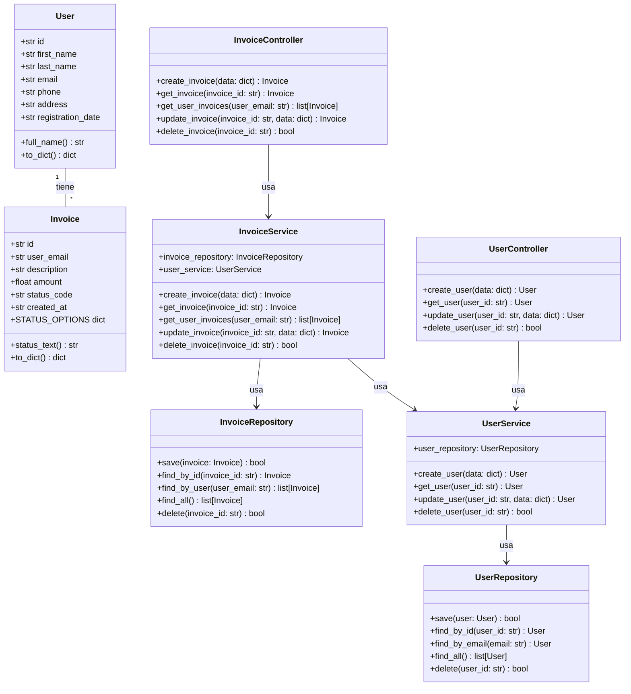
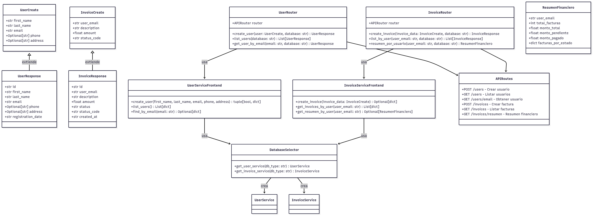
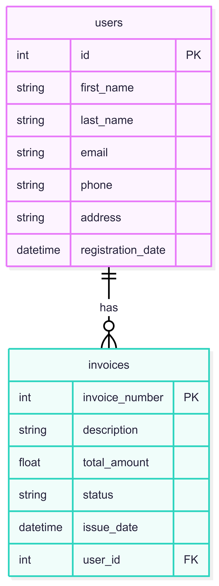
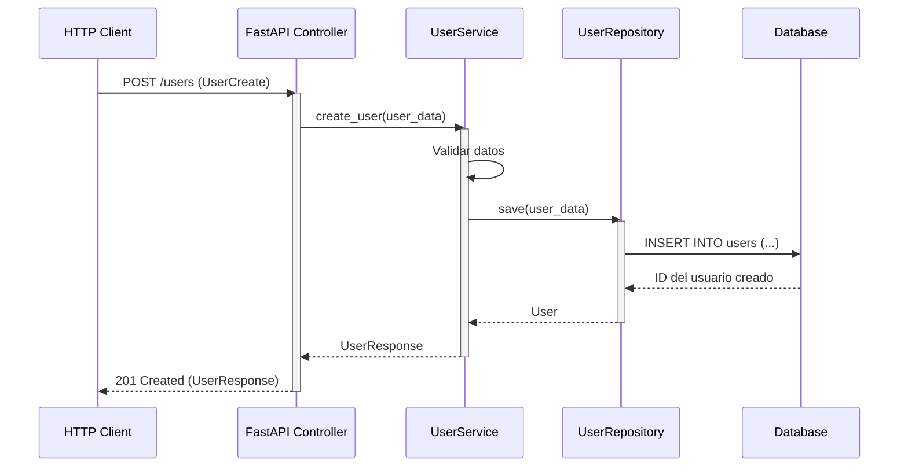
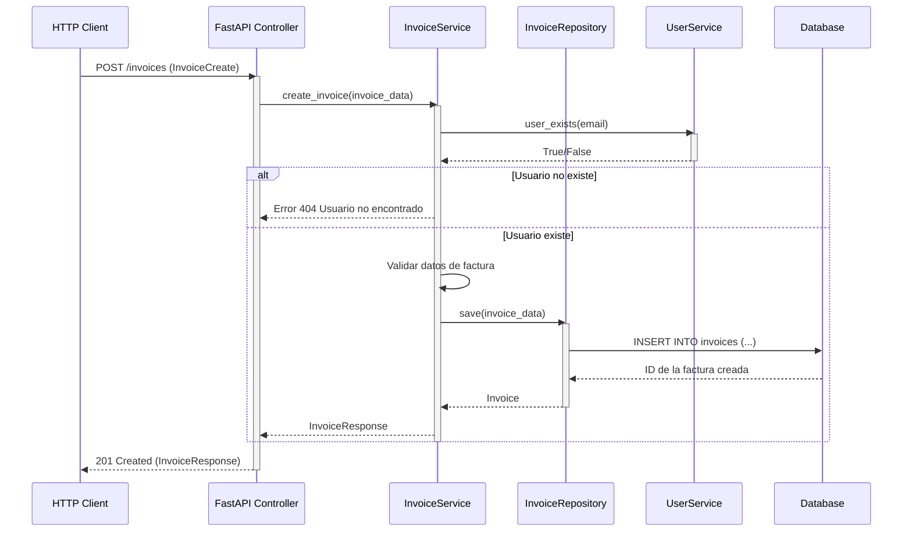
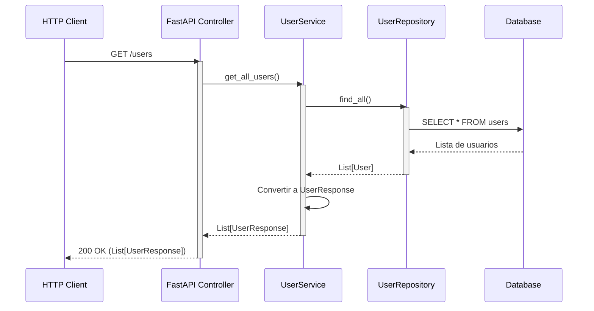

# CRM System
Customer Relationship Management system in Python with scalable architecture.

# CRM System

Customer Relationship Management (CRM) system built in Python with a scalable architecture. This project includes a backend and frontend implementation, leveraging SQLite as the database.

---

## Table of Contents

1. [Overview](#overview)
2. [Architecture](#architecture)
   - [Backend](#backend)
   - [Frontend](#frontend)
3. [Diagrams](#diagrams)
   - [Class Diagram](#class-diagram)
   - [Detailed Class Diagram](#detailed-class-diagram)
   - [Relational Database Model](#relational-database-model)
   - [Use Cases and Sequence Diagrams](#use-cases-and-sequence-diagrams)
4. [Installation](#installation)
5. [Running Locally](#running-locally)
6. [API Documentation](#api-documentation)

---

## Overview

This CRM system allows users to manage customer data and invoices efficiently. It is designed with a modular architecture to ensure scalability and maintainability. The backend handles business logic and persistence, while the frontend exposes an API for interaction.

---

## Architecture


El sistema sigue una arquitectura limpia por capas, que separa controladores, servicios, repositorios y esquemas. Esto facilita el mantenimiento, escalabilidad y desacoplamiento entre frontend y backend.

- Backend: FastAPI con SQLite y estructura modular.
- Frontend: Next.js (exportado desde v0.dev) para la interfaz gráfica.
- Infraestructura: Uso local, sin Docker por el momento.

### Backend
El backend está desarrollado en FastAPI, con una estructura profesional por capas:

routers/: define los endpoints REST.
schemas/: valida los datos de entrada y salida.
services/: implementa la lógica de negocio.
repositories/: gestiona el acceso a la base de datos (SQLite).
utils/database.py: permite alternar entre bases de datos según .env.

### Frontend
La interfaz de usuario está desarrollada en Next.js, exportada desde v0.dev, y conectada a la API REST del backend. Permite interactuar con el sistema CRM (crear usuarios, consultar facturas, etc.) desde el navegador.

Corre localmente en http://localhost:8000 (según configuración del frontend).
Se comunica con la API del backend en http://localhost:3000.
Está desacoplado del backend, respetando la arquitectura por capas.

---

## Diagrams

### Class Diagram



- User e Invoice: Modelos de datos principales.
- Controllers: Manejan las solicitudes HTTP.
- Services: Contienen la lógica de negocio.
- Repositories: Gestionan el acceso a datos.
- Relaciones: Muestra cómo interactúan las clases.

### Detailed Class Diagram




Incluye:
- Entidades de Dominio
- Capa de Controladores (FastAPI)
- Capa de Servicios
- Capa de Repositorios
- Relaciones Principales
- Patrones de Diseño
- Validaciones
- Mapeo ORM


### Relational Database Model



Relaciones:

Un usuario (users) puede tener múltiples facturas (invoices)
La relación se establece a través del campo user_email en la tabla invoices que referencia el campo email en la tabla users

Claves Principales (PK)
users.id: Identificador único de cada usuario
invoices.id: Identificador único de cada factura
Claves Foráneas (FK)
invoices.user_email: Referencia a users.email (relación uno a muchos)
Índices
users.email: Para búsquedas rápidas por correo
invoices.user_email: Para optimizar consultas de facturas por usuario
Feedback submitted


### Use Cases and Sequence Diagrams

#### Create User


#### Create Invoice


#### List Users



---


## Deployment

1. Clone the repository:
   ```bash
   git clone https://github.com/your-repo.git
   cd your-repo

2. Crea un entorno virtual e instalalo (opcional)

```bash
python -m venv venv
source venv/bin/activate        # En Windows: venv\Scripts\activate
```

3. Instala las dependencias
```bash
pip install -r requirements.txt
```

4. Crea el archivo .env con la configuración de base de datos

En la raíz del proyecto, crea un archivo llamado .env y agrega lo siguiente:

```bash
DATABASE_URL=sqlite:///./crm.sqlite
```

5. Inicializa la base de datos
```bash
python -m backend.init_db
```

6. Ejecuta el backend (en la terminal)
```bash
python -m backend.main
```
Esto ejecuta la lógica del CRM desde consola y conecta con la base de datos crm.sqlite.

7. Ejecuta el frontend (API FastAPI para probar desde Swagger UI)

```bash
uvicorn frontend.main_fastapi:app --reload --port 8000

```
Esto levanta el servidor de la API en modo desarrollo en el puerto 8000.

8. Accede a la documentación de la API:

Frontend (FastAPI docs): http://localhost:8000/docs


## Requisitos

